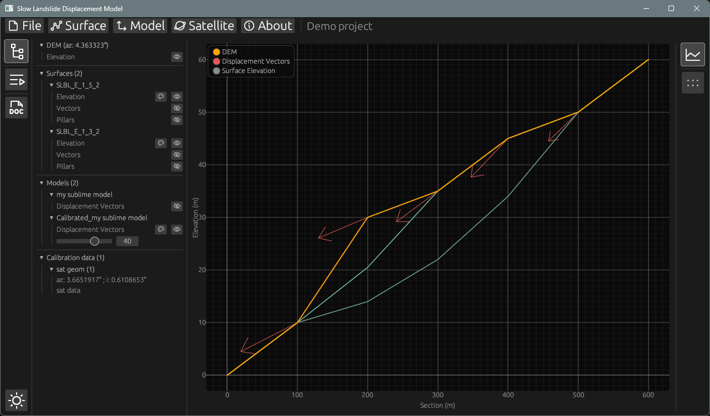

# ⛰️Slow Landslide Displacement Model (SLDM)🛰️

This software aims to present a simple displacement model for slow moving landslides. The model is derived from a failure surface and its amplitude is calibrated using InSAR data. Surfaces can be imported or generated using the [SLBL method][1]. Section and SAR geometry are expressed as spherical geometries, and internally converted into a cartesian geometry (see [`vec_proj.rs`](src-logic/src/data/vec_proj.rs)). [QuickStart documentation](src/documentation.md) is available directly in the software.

This code was initialy developped during an internship an [Risk Group](https://wp.unil.ch/risk/) - UNIL (Lausanne, Switzerland) 2023 in Python, featuring a Python / Qt interface. This code is still available as an archive branch.

_**THIS IS RESEARCH CODE PROVIDED TO YOU "AS IS" WITH NO WARRANTIES OF CORRECTNESS. USE AT YOUR OWN RISK.**_

## Installation

The binary is available in this repository: [latest release](https://github.com/LeoLetellier/SLBL-FSA/releases/latest).

Binaries are compiled for Windows, Ubuntu and MacOS, and tested on Windows 11 and Ubuntu 24 LTS. They are used as standalone. There is no installer for now.

## Example project

An example project is available [here]().

## Features

### Project

The project is defined by its Digital Elevation Model (DEM).

    * Saving
    * Loading

### Surfaces

    * Importing
    * SLBL matrix
    * SLBL routine
    * Minimum or maximum values from other surfaces

### Model

    * From surface
    * Combining multiple surfaces
    * Apply custom gradient
    * Calibrate using InSAR data

## Technologies

The present code uses the programming language [Rust](https://www.rust-lang.org) designed for performance and reliability. It relies on multiple libraries or crates, which can be found in the [project manifest](Cargo.toml) or in its [library](src-logic/Cargo.toml).

The Graphical User Interface (GUI) relies on [egui](https://github.com/emilk/egui), an immediate mode GUI library written in Rust.

## Support

If you encounter an issue when using the software, or you want to propose an enhancement, please raise an issue in this repository.

Please note that this project is not in active development.

## License

This projected is licensed under [MIT](LICENSE_MIT) or [Apache-2.0](LICENSE_APACHE-2.0).

[1]: <https://www.sciencedirect.com/science/article/abs/pii/S0013795219302078?via%3Dihub> "A review of methods used to estimate initial landslide failure surface depths and volumes, 
Jaboyedoff and al., 2020"